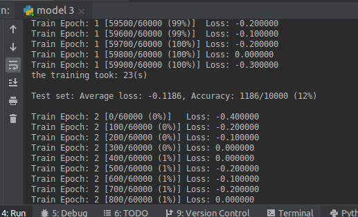

## Optical Flow

### Full resolution flow detection

### 1/2 resolution flow detection

### 1/4 resolution flow detection

### 1/8 resolution flow detection

### 1/16 resolution flow detection

## Convolutional Neural Nets

### Step1
 

### Step 2

At 99% by epoch 30

### Step 3

Strange output because accuracy starts very low and the loss is often 0.00 . There is likely an error in my network design. 

