## Optical Flow
Input images:

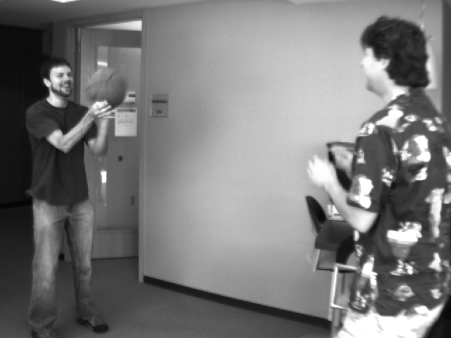
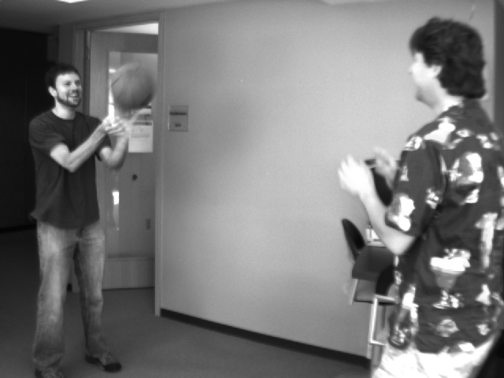

### Full resolution flow detection
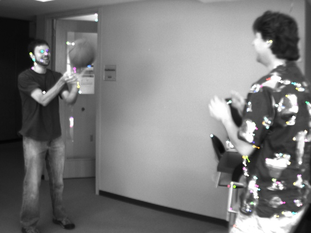

### 1/2 resolution flow detection
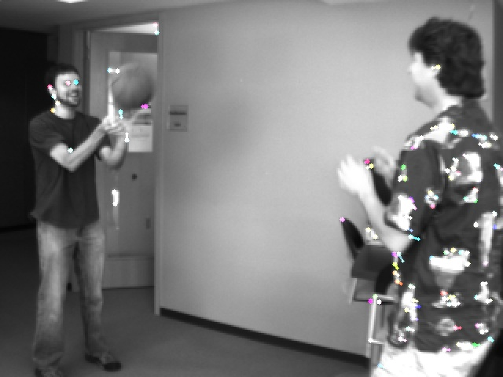

### 1/4 resolution flow detection
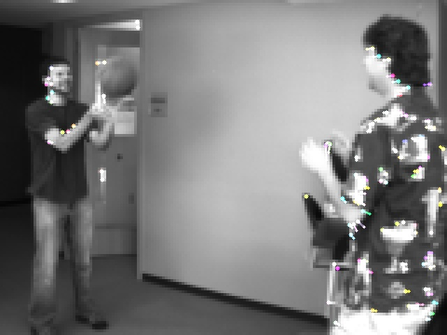

### 1/8 resolution flow detection
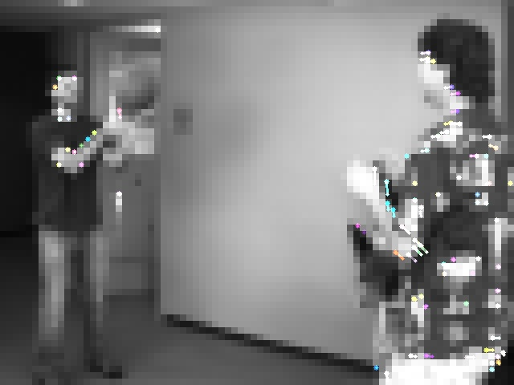

### 1/16 resolution flow detection
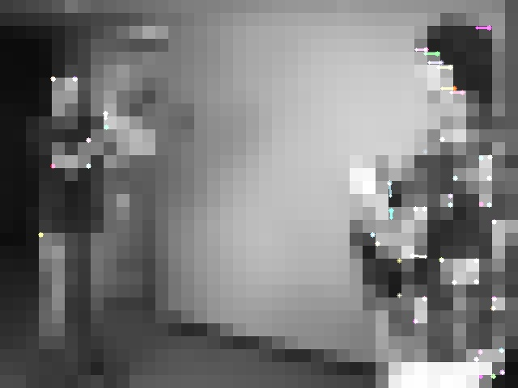

## Convolutional Neural Nets

### Step1
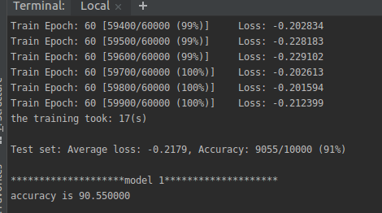 

### Step 2

At 99% by epoch 30

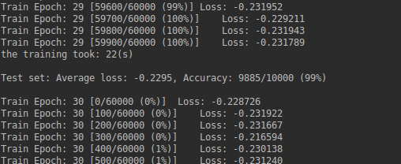

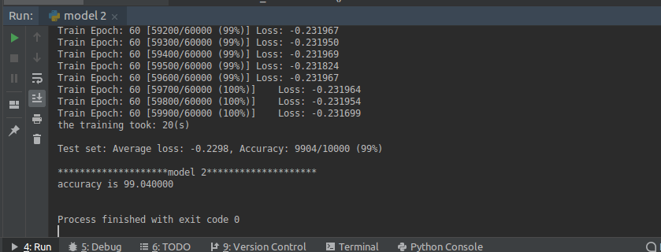

### Step 3

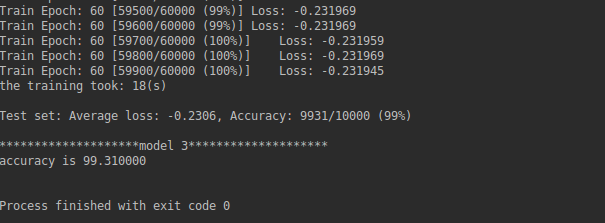

### Step 4
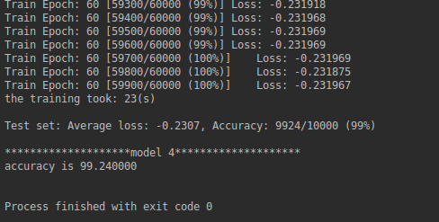

### Step 5
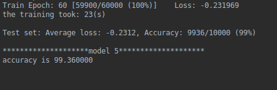